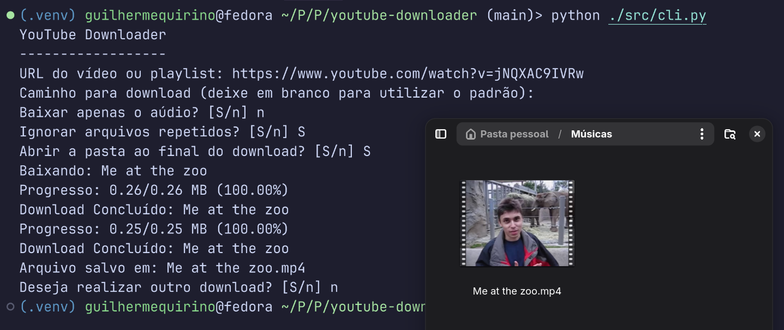

# YouTube Downloader
Ferramenta de linha de comando para baixar áudios, vídeos e playlists do YouTube



## Sobre
Após tentar utilizar várias ferramentas para fazer o download de vídeos do YouTube, principalmente o áudio, decidi desenvolver uma utilizando Python

## Instruções
### Dependências
- [Python](https://www.python.org/)
  - a versão utilizada foi a 3.13.3
- [pytubefix](https://github.com/JuanBindez/pytubefix)
- [moviepy](https://github.com/Zulko/moviepy)
- [dotenv](https://github.com/theskumar/python-dotenv)

### Como utilizar
- Clone o repositório do projeto
```bash
$ git clone github.com/GuilhermeQuirinoCruz/youtube-downloader
```

- **(Opcional)** Crie e execute um *ambiente virtual*
```bash
$ python -m venv venv
$ source ./.venv/bin/activate
```

- Instale as dependências
```bash
$ pip install requirements.txt
```

- Crie um arquivo **.env** na raíz do projeto
  - Se estiver num ambiente Linux, pode utilizar o comando *touch*
```bash
$ touch .env
```

- Defina um local de download padrão dentro do arquivo **.env**
```python
DEFAULT_DOWNLOAD_PATH=[caminho/do/download]

# Exemplo
DEFAULT_DOWNLOAD_PATH='/var/home/[usuario]/Músicas'
```

- Execute o projeto
```bash
$ python ./src/cli.py
```

- Siga as instruções, fornecendo a **URL** do vídeo/playlist e alterando as opções de pasta de destino, download **apenas do áudio**, **criação de pasta** (no caso das playlists) e **abertura da pasta automaticamente** ao final do download

## Limitações conhecidas
1. Por enquanto, o programa realiza o download apenas na maior qualidade disponível
2. A pasta temporária utilizada deve ser a *".temp"*, localizada na raíz do projeto
3. O projeto foi testado apenas no Linux - *Fedora Silverblue 42.20250526.0*

## Linha do tempo e próximos passos
- [x] Tornar o programa utilizável
- [x] Desenvolver uma CLI simples
- [ ] Implementar uma interface melhor, utilizando a biblioteca [Textual](https://github.com/Textualize/textual)
- [ ] Permitir escolha de qualidade do download